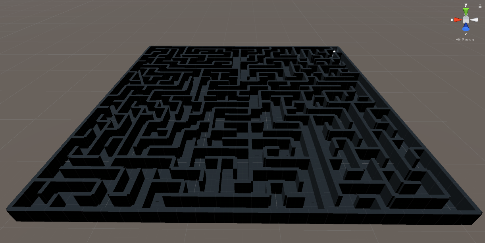
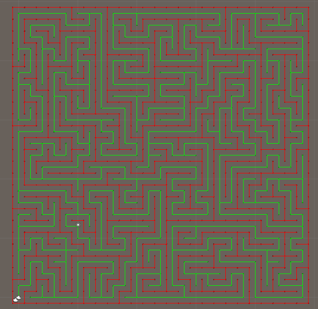
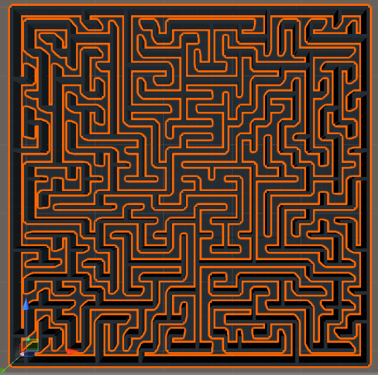
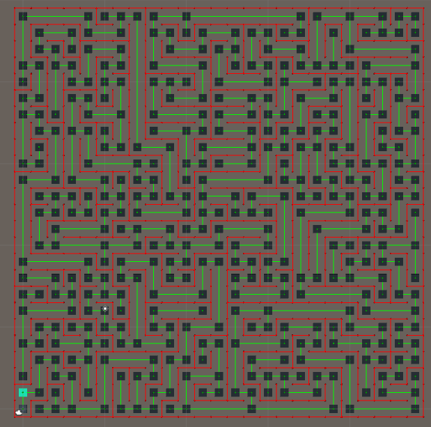

# GoogleCardboard-Procedural-VR-Maze
## Overview
This project is an example of a procedurally generated maze, including a player navigation system suitable for mobile VR.

The maze is randomly generated using a variant of Primm's algorithm with a variable height and width.

## Getting Started
* Pull this repo
* Open the project in Unity
* Hit play
* To move the camera hold down the `alt` key and move your mouse
* To move to a selected waypoint, left click

Note: You may need to update the project to get it to work with your version of Unity. This project is currently built for `2017.1.0f3`. Alternatively you can use Unity Hub to manage multiple versions of Unity on your machine.

## Building
Follow the standard process for building a project for Unity. The Google Cardboard library is included in this repo and it should just work.

On Google Cardboard simply look around to select a waypoint, and press the action button to move.

## How It Works
### Graph
The maze is built on top of an extensible graph structure, made up of nodes and connections. You can find the source for this in `Assets/Scripts/Graph`.

The base Graph classes handle simple things, such as adding a node from the list of nodes making up the graph, and connecting those nodes. It is also capable of searching for a connection between nodes.

The `PositionalGraph` classes add Vector3 positions to the basic graph node and extend the base Graph class to find nodes which are at or near a given Vector3 and to connect nodes based on proximity.

These classes are very simplistic and could be further optimized. This has not proven a problem as yet on mobile devices (premature optimization is a sin) - however it is a target area if overall performance improvements, specifically in the search / find operations.

### The Maze
The Maze is made up of several graphs (One for the wall, one for the floor spaces and one for the actual nodes a player can teleport between). The source can be found in `Assets/Scripts/Maze`. It also has a DebugRenderer to help visualize what is going on.

#### Maze Generation
When instanced, the Maze will make use of `ProceduralMazeGenerator` to create the required graphs based on the given width, height and spacing. It uses the current time as a seed, however it could be easily extended to take a user provided seed.

The process looks something a bit like this:
* The generator creates the graphs with the specified dimensions
* Wall nodes are connected to other wall nodes within range
* Each floor node is traversed using a backtraced depth first search and carves out the openings by removing wall connections

What does that mean?

* All cells begin as unvisited
* The first cell is removed from the unvisited stack and set as the current cell
* Whilst there are any unvisited cells
 * Neighbours of the current cell are determined by Vector3 distance
 * Each neighbour is tested to see if it has been visited
 * If there is an univisted neighbour
   * A random neighbour is picked
   * A passage is created between them, and the connecting wall blocking the passage is removed
   * The selected neighbour becomes the new current cell
 * If there is not an unvisited neighbour
   * We back track to find a cell which has been visited which has unvisited neighbours by popping the last cell from the stack

This results in a maze made up of wall and floor graphs which looks like this when rendered:

If this is tricky to get your head around - https://en.wikipedia.org/wiki/Maze_generation_algorithm is actually a pretty good starter - see **Randomized Prim's algorithm**.

#### Mesh Generation
Once we have the above graphs it's pretty straightforward to generate our mesh.

`MazeMeshGenerator` takes charge of this using some primitives and stiched primitives found in `Assets/Scripts/Mesh`. The winding order handled at this point based on the orientation of the wall. These meshes are then used as the MeshFilter for rendering and as a MeshCollider for collisions.

This works fairly well, but again the mesh could probably be better optimized to improve physics and rendering performance.

We make use of Unity's standard prototyping assets so that distance can be accurately  perceived. 

## Player 
As a player your have two capabilities:

* Look around
* Move to an adjacent waypoint

This is what it looks like to a player:

### Looking Around
Looking around is very trivial, we simply use the Google VR library to provide the Pitch/Yaw/Roll on mobile and also the mouse interaction during debugging

### Movement and Navigation
Movement is also fairly trivial - but we do add a couple of tricks.

Firstly we don't want to the player to have to navigate to every cell in the maze - that's just annoying! Instead we generate a player navigation graph which places waypoints *at each cell were a player makes a decision*:

From here it is fairly trivial to raycast out from the center of the view to hit our waypoints. When a hit waypoint is connected to the way point the player is currently on it will highlight and they can move to it. 

Movement is simply a lerp between the two positions, along with some camera blur to relieve motion sickness somewhat. It should be noted that some people may find an instant teleport to be even more comfortable.

This gaze based navigation can all be found under `Assets/Navigation` whilst the simple movement script can be found under `Assets/Player`.
